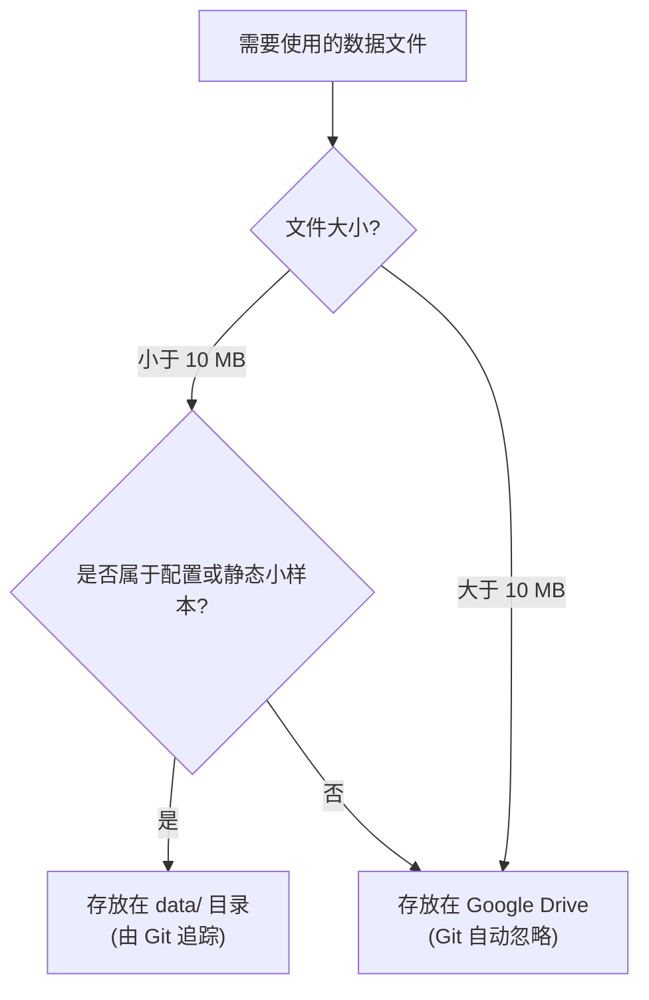

# Jupyter Notebook 最佳实践项目模板（Colab + uv 优化版）

这是一个专为 **Jupyter Notebook 管理** 打造 of Git 仓库模板，特别针对 **Google Colab 同步与协作** 进行了架构优化，并推荐使用现代化包管理工具 **uv**。

---

## 📂 目录结构

```text
.
├── .gitattributes               # 配置 Jupyter 提交过滤器 (自动清理输出)
├── .gitignore                   # 过滤 Python 临时文件与大型数据文件
├── README.md                    # 本说明文档
├── requirements.txt             # 【全局依赖】仅存放通用开发工具 (如 nbstripout)
├── data/                        # 【小额数据】存放配置文件、小测试数据 (< 10MB)
│   └── .gitkeep
├── src/                         # 【复用模块】存放可在多个 Notebook 间共享的 Python 脚本
│   └── utils.py                 # 提供双端挂载、路径智能获取等辅助函数
└── notebooks/                   # 【笔记本库】
    ├── .gitkeep
    └── project_analysis_demo/   # 【子项目示例】
        ├── analysis.ipynb       # 演示 Notebook
        └── requirements.txt     # 【局部依赖】该子项目特有的第三方库 (如 pandas, matplotlib)
```

---

## 🚀 最佳实践 1：版本控制优化 (清除 Notebook 输出)

Jupyter Notebook (`.ipynb`) 文件本质上是 JSON 文件。如果直接将运行后的 Notebook 提交到 Git，会污染 Diff 历史。

### 🛠️ 本地环境初始化 (使用 uv)
我们在 `.gitattributes` 中配置了 `filter=nbstripout`。您只需在**本地**安装 `uv` 并执行以下命令一次，此后 `git commit` 时就会自动在后台清除 Notebook 中的输出和执行计数，保持 Git History 绝对干净：

```bash
# 1. 安装 uv (如果本地还没有)
# macOS: brew install uv
# 其它平台: curl -LsSf https://astral.sh/uv/install.sh | sh

# 2. 在项目根目录下创建虚拟环境 (默认创建在 .venv)
uv venv

# 3. 激活虚拟环境 (macOS)
source .venv/bin/activate

# 4. 极速安装全局开发依赖 (nbstripout)
uv pip install -r requirements.txt

# 5. 在当前 Git 仓库中激活过滤属性
nbstripout --install
```

> [!NOTE]
> 该配置只在您提交时临时过滤，**不会**影响您本地编辑时看到的输出。另外，从 Google Colab 界面直接“保存副本到 GitHub”时不受本地 filter 限制，依然能完整保留输出。

---

## 📦 最佳实践 2：依赖管理 (全局 vs 局部)

每个 Notebook 的研究主题各不相同（如 NLP、图像处理、金融分析），为了防止库版本冲突和环境臃肿，我们采用**分层维护模式**：

1. **全局依赖 (`./requirements.txt`)**：仅包含开发工具（如 `nbstripout`）。
2. **局部依赖 (`./notebooks/<your_project>/requirements.txt`)**：存放该具体研究项目专用的库。

### 💻 在 Colab 中动态安装子项目依赖 (一劳永逸同步)
当您在 Colab 中打开某个子项目笔记本时，在 Notebook 首个单元格内运行以下代码，它会自动检测当前环境并配置完整环境（如未同步到 Drive，将**自动克隆至 Drive 中永久存储**，无需每次重复拉取，且修改实时云端保存）：

```python
import sys
import os

# 1. 智能检测是否在 Colab 运行
if 'google.colab' in sys.modules:
    GITHUB_USER = "nothing248"
    REPO_NAME = "notebooks"
    
    COLAB_LOCAL_PATH = f"/content/{REPO_NAME}"
    DRIVE_BASE_PATH = "/content/drive/MyDrive"
    DRIVE_PATH = f"{DRIVE_BASE_PATH}/{REPO_NAME}"
    
    # 2. 尝试挂载 Google Drive
    has_drive = False
    try:
        from google.colab import drive
        drive.mount('/content/drive')
        has_drive = os.path.exists(DRIVE_BASE_PATH)
    except Exception as e:
        print("提示: 未挂载 Google Drive，将使用 Colab 临时运行环境。")
    
    # 3. 决定克隆与运行路径
    if has_drive:
        REPO_PATH = DRIVE_PATH
        # 如果 Google Drive 中不存在该仓库，则自动克隆到 Drive 中永久保留
        if not os.path.exists(REPO_PATH):
            print(f"Google Drive 中未检测到仓库。正在自动克隆到您的 Google Drive...")
            os.chdir(DRIVE_BASE_PATH)
            !git clone https://github.com/{GITHUB_USER}/{REPO_NAME}.git
        else:
            print(f"检测到 Google Drive 中已存在仓库，直接使用: {REPO_PATH}")
    else:
        # 如果未授权 Drive，则退回到 Colab 本地临时虚拟机路径克隆
        REPO_PATH = COLAB_LOCAL_PATH
        if not os.path.exists(REPO_PATH):
            print("正在自动将 GitHub 仓库克隆到 Colab 临时运行环境...")
            !git clone https://github.com/{GITHUB_USER}/{REPO_NAME}.git {REPO_PATH}
        else:
            print(f"Colab 临时运行环境中已存在仓库: {REPO_PATH}")
            
    # 4. 切换工作路径到当前 Notebook 所在的子项目目录
    TARGET_SUBDIR = os.path.join(REPO_PATH, "notebooks", "project_analysis_demo")
    os.chdir(TARGET_SUBDIR)
    print(f"当前工作目录已成功切换至: {os.getcwd()}")
    
    # 5. 安装 uv 并极速安装子项目局部依赖到 Colab 全局系统
    !pip install uv
    !uv pip install --system -r requirements.txt
```

---

## 💾 最佳实践 3：数据存储划分决策

为防止 Git 仓库性能退化，我们建议遵守以下数据划分准则：



### 🔗 在 Colab 中优雅地跨平台读取数据
无论在本地还是 Colab，我们都推荐使用 `src/utils.py` 中的 `get_data_path()` 函数来规约数据路径，它会自动探测项目根目录：

```python
# 确保项目根目录在 sys.path 中
import sys, os
# ... (具体寻径代码见示例 notebook) ...

from src.utils import get_data_path

# 获取数据路径（本地或 Colab 挂载点）
data_file = get_data_path("my_large_dataset.csv")

# 读写数据
import pandas as pd
df = pd.read_csv(data_file)
```

---

## 🔄 最佳实践 4：Google Colab 同步指南

您有两种方式实现 Colab 与 GitHub 的双向同步：

### 方案 A：通过 GitHub 插件直接同步 (最推荐，适合轻量修改)
1. **打开**：访问 [Google Colab](https://colab.research.google.com/)，选择 **GitHub** 标签页，输入您的仓库地址并选择对应的 `.ipynb` 文件打开。
2. **在 Notebook 中添加快捷打开徽章**：
   在 Notebook 顶部添加如下 Markdown：
   ```markdown
   [](https://colab.research.google.com/github/nothing248/notebooks/blob/main/notebooks/project_analysis_demo/analysis.ipynb)
   ```
3. **保存**：修改完成后，点击 **File -> Save a copy in GitHub**，即可将修改直接提交回 GitHub 仓库（带输出）。

### 方案 B：Google Drive 挂载 + Git 同步 (适合重度开发/大型数据集)
1. 在本地或 Colab 中将仓库克隆至 Google Drive 中的特定目录下：
   ```bash
   # 在 Colab 挂载 Drive 后运行
   %cd /content/drive/MyDrive
   !git clone https://github.com/nothing248/notebooks.git
   ```
2. 在 Colab Notebook 中开发。所有修改会自动实时保存到您的 Google Drive。
3. 当需要将修改推送到 GitHub 时，直接在 Notebook 中运行以下命令：
   ```python
   !git config --global user.name "nothing248"
   !git config --global user.email "your.email@example.com"
   !git add .
   !git commit -m "update: training results"
   !git push
   ```
